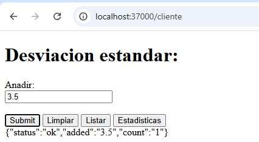
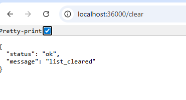

# Calculadora Web para estimar la media y la desviación estándar de un conjunto de números  - Parcial 1 AREP


## Comandos para ejecutar

### 1. Compilar el proyecto
```bash
mvn clean install
```

### 2. Ejecutar los servidores

#### En la primera terminal :
```bash
java -cp target/classes co.edu.escuelaing.parcial1arep.Facade
```

#### En una segunda terminal - HttpServer:
```bash
java -cp target/classes co.edu.escuelaing.parcial1arep.HttpServer
```

### 3. Acceder a la aplicación

```
http://localhost:37000/cliente
```


## Ejemplo
1. **ADD**: x=3.5   
- Respuesta: `{
  "status": "OK",
  "added": 3.5,
  "count": 1
}`



2. /list
   - Respuesta: `{
  "status": "OK",
  "values": [3.5, 2.0, 10]
}`

3. /clear
   - Respuesta: `{
  "status": "OK",
  "message": "list_cleared"
}`



4. /stats
   - Respuesta: `{
  "status": "OK",
  "mean": 5.1666666667,
  "stddev": 3.2071349027,
  "count": 3
}`

## Autor
Zayra Gutierrez
